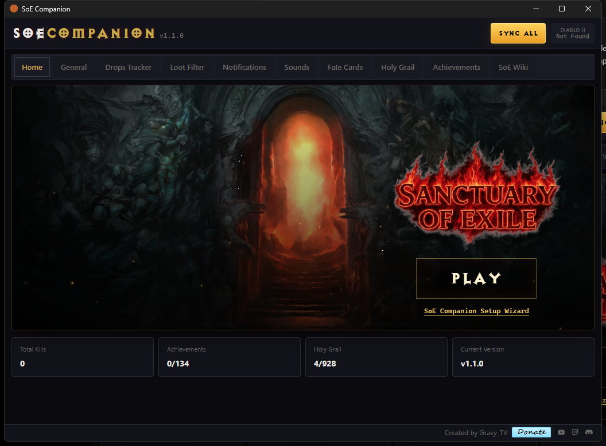
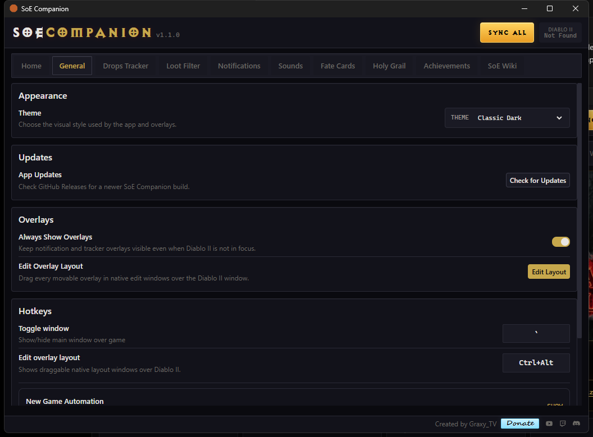
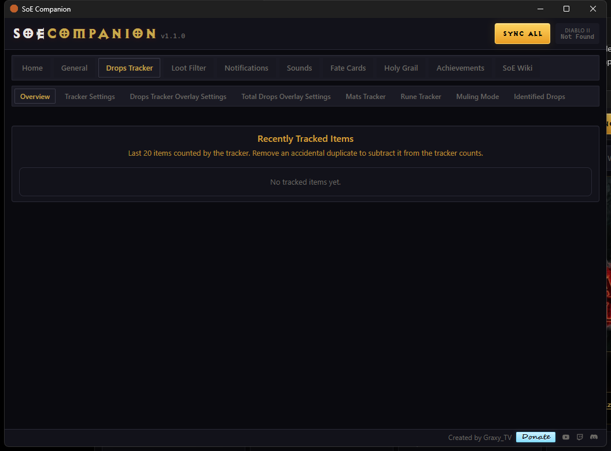
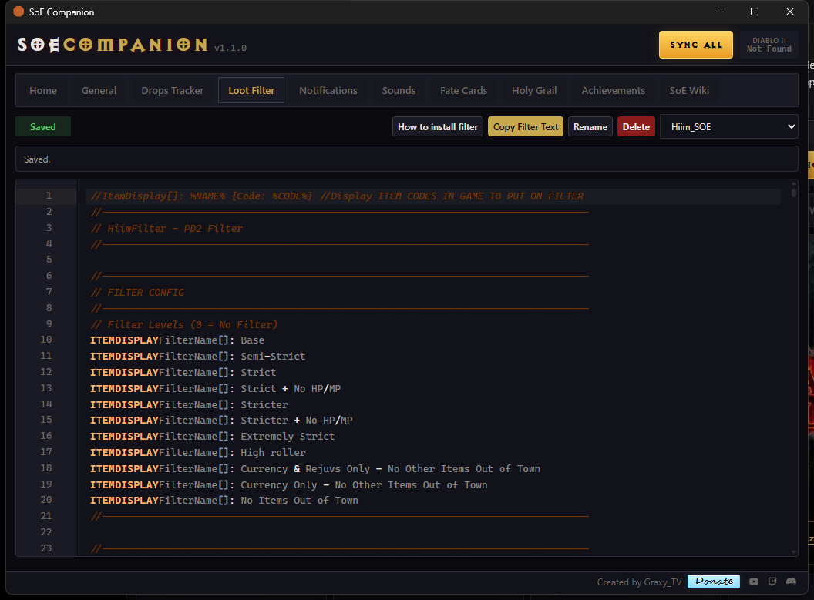
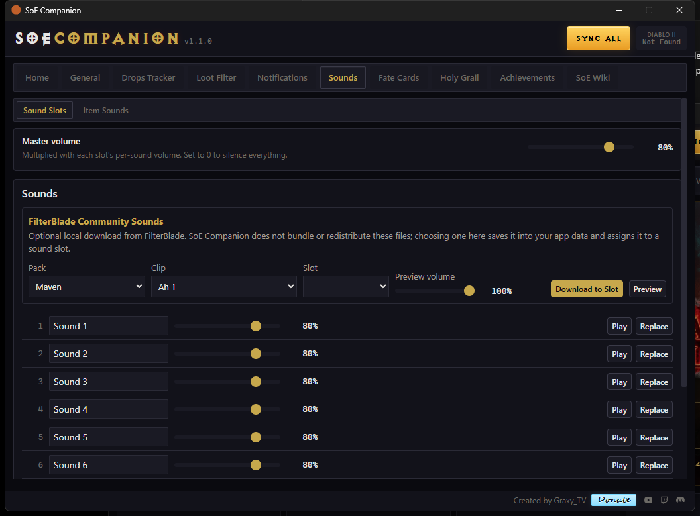
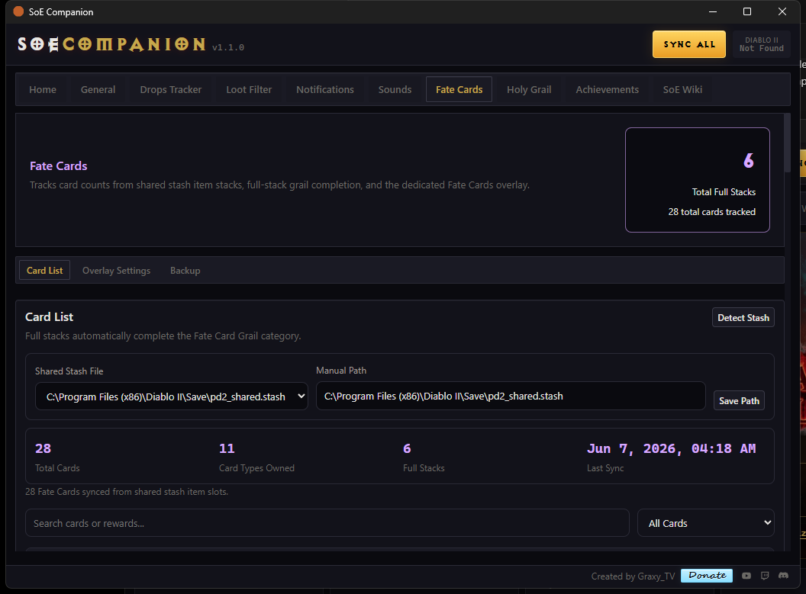
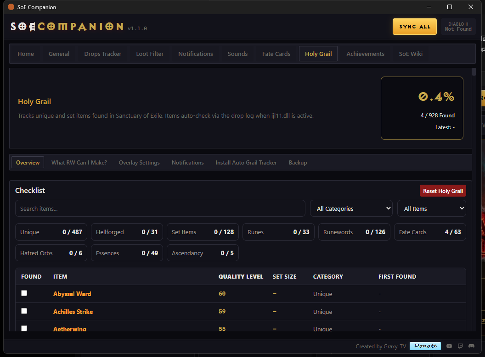
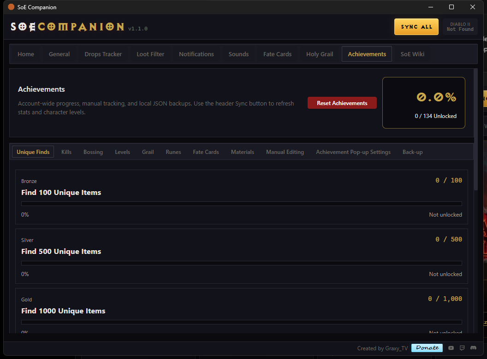

# SoE Companion

SoE Companion is a Windows companion app for Sanctuary of Exile built around drop tracking, Holy Grail progress, Fate Cards, achievements, loot filter editing, item sounds, and movable in-game overlays.

The app is designed for players who want their grail, materials, runes, cards, sounds, and achievement progress in one place while keeping the normal Diablo II gameplay window clean.

[Download the latest release](https://github.com/graxytv/SoE-Companion-v1.0.0/releases/latest)



## Highlights

- Live drop tracking for uniques, hellforged items, sets, runes, runewords, Fate Cards, Hatred Orbs, essences, ascendancy items, charms, jewels, and SoE materials.
- Holy Grail tracking across classic grail categories and new SoE 13.0.0 categories.
- Fate Card stash sync with card tiers, full stack sizes, full stack rewards, and full-stack grail completion.
- Drag-and-resize overlay layout mode for the in-game tracker cards.
- Customizable notification popups and item-specific sound rules.
- Built-in loot filter editor with line numbers, install help, and bundled SoE filter rules.
- Account-wide achievements with bossing sub-tabs, level tracking, popup settings, and backups.
- Master `Sync All` button for shared stash, Fate Cards, account stats, character levels, and runeword materials.
- GitHub release updater from the General tab.

## Screenshots

| General Settings | Drops Tracker |
| --- | --- |
|  |  |

| Loot Filter | Sounds |
| --- | --- |
|  |  |

| Fate Cards | Holy Grail |
| --- | --- |
|  |  |

| Achievements |
| --- |
|  |

## Installation

1. Open the [latest GitHub Release](https://github.com/graxytv/SoE-Companion-v1.0.0/releases/latest).
2. Download `soe-companion.exe`.
3. Run the app on Windows.
4. Use the `SoE Companion Setup Wizard` from the Home tab to configure paths, the loot filter, the drop hook, sounds, overlays, stash sync, and hotkeys.

Some actions touch Diablo II files. Close Diablo II before installing the Auto Grail Tracker hook, installing or changing Identified Drops settings, or resetting account stats.

## Main Tabs

### Home

The Home tab is the launchpad for the app.

- Shows game status and current app version.
- Provides the `Play` button for starting Diablo II.
- Opens the setup wizard.
- Summarizes total kills, achievement unlocks, and Holy Grail progress.
- Keeps the master `Sync All` button visible in the header.

### General

General contains app-wide settings and maintenance tools.

- Theme selection.
- GitHub release update checks and install flow.
- `Always Show Overlays` for keeping overlays visible outside game focus.
- `Edit Overlay Layout` for moving and resizing overlay windows.
- Hotkeys for toggling the main app window and overlay layout editor.
- New Game Automation configuration.
- Reset Account Stats, including local stash data and account-setting reset behavior.

### Drops Tracker

The Drops Tracker tab controls live drop counting and the tracker overlays.

- `Overview` shows recently tracked items and lets you remove accidental duplicate entries.
- `Identified Drops` installs and configures the hook that can make selected item qualities drop identified.
- `Tracker Settings` controls shared tracker overlay behavior.
- `Drops Tracker Overlay Settings` controls the resettable session tracker.
- `Total Drops Overlay Settings` controls persistent lifetime totals.
- `Mats Tracker` lets you choose which SoE materials show in the material overlay.
- `Rune Tracker` lets you choose which runes show in the rune overlay.
- `Muling Mode` pauses drop, grail, recent item, run-count, and timer tracking while moving items.

Tracked categories include uniques, hellforged items, sets, low/mid/high runes, runewords, charms, jewels, Fate Cards, Hatred Orbs, essences, ascendancy items, and SoE materials.

### Loot Filter

The Loot Filter tab is a built-in editor for the bundled SoE filter.

- Line numbers beside the editor for easier support and debugging.
- Install instructions for putting the filter into Diablo II.
- Copy, rename, delete, and save controls.
- Bundled `Hiim_SOE` filter support.
- SoE 13.0.0 item rules for Fate Cards, essences, Hatred Orbs, ascendancy items, and currency/material additions.
- Syntax reference panel for filter editing.

### Notifications

Notifications controls visual item popup behavior.

- Enable or disable the notification overlay.
- Adjust display duration.
- Scale popup size.
- Adjust background opacity.

Sounds are configured separately in the Sounds tab so notification visuals and audio rules stay easy to reason about.

### Sounds

Sounds manages both reusable sound slots and item-specific sound rules.

- Master volume.
- Sound slots with per-slot labels, volume, preview, replacement, and clearing.
- FilterBlade community sound download helper.
- Item Sounds sub-tab for assigning sounds to individual items or categories.
- Item sound categories for uniques, sets, runes, Fate Cards, essences, materials, runewords, hellforged items, and custom rules.

### Fate Cards

Fate Cards is a dedicated tab for SoE card tracking.

- Reads Fate Card stacks from the selected `pd2_shared.stash`.
- Auto-syncs about every 30 seconds.
- Also refreshes from the header `Sync All` button.
- Shows total cards, card types owned, total full stacks, and last sync time.
- Lists each card with card tier, current count, full stack size, total full stacks, and full stack reward.
- Click a card to view its details and reward text.
- Filters by all cards, owned cards, full stacks, or incomplete stacks.
- Full stacks automatically complete Fate Card Holy Grail entries.
- Overlay settings let you track specific cards, full card tiers, or a mix of both.
- Backup and restore support keeps Fate Card progress safer between changes.

### Holy Grail

Holy Grail tracks checklist-style collection progress.

- Categories: Unique, Hellforged, Set Items, Runes, Runewords, Fate Cards, Hatred Orbs, Essences, and Ascendancy.
- Fate Card grail completion requires a full stack, not just one card.
- Search, filter, and sort checklist entries.
- Click items for details when item data is available.
- `What RW Can I Make?` syncs runes from shared stash and shows makeable runewords.
- `Install Auto Grail Tracker` installs and checks the drop hook.
- Overlay settings control the compact Grail Progress overlay.
- Notification settings control first-time grail item alerts.
- Backup and restore support protects grail progress.

### Achievements

Achievements tracks account-wide goals and unlocks.

- Categories for unique finds, kills, bossing, levels, grail completion, runes, Fate Cards, and materials.
- Bossing achievements are split into focused boss sub-tabs like DClone, Rathma, Lucion, Kiln, Uber Tristram, Uber Ancients, act bosses, map bosses, and dungeon bosses.
- Fate Card milestones include total Fate Card finds and Tier 0 Fate Card find goals.
- Character level achievements can sync from character data and can be manually edited as a fallback.
- Achievement unlock popups have their own display settings.
- Achievement progress overlay can be moved and resized from overlay layout mode.
- Full backup and category snapshot support.

### SoE Wiki

The SoE Wiki tab embeds the wiki/reference experience directly in the app so players can check information without leaving the companion.

## Overlays

SoE Companion can render multiple movable overlays:

- Item notifications.
- Drops Tracker.
- Total Drops.
- Grail Progress.
- Rune Tracker.
- Mats Tracker.
- Fate Cards.
- Achievement Progress.
- Achievement unlock popup.
- Monster Kills.
- Muling indicator.

Use `General > Edit Overlay Layout` or the edit-overlay hotkey to enter layout mode. In layout mode, overlay cards can be dragged and resized directly instead of using X/Y or width/height sliders.

## Syncing

The header `Sync All` button is the main sync entry point.

It refreshes shared-stash data, Fate Card stacks, rune materials for runeword planning, account stats, and character levels. Fate Cards and runeword materials also auto-sync periodically when their tabs are open.

## Data And Backups

The app stores progress locally. Holy Grail, Fate Cards, and Achievements include backup and restore tools so progress can be recovered or moved more safely.

## Development

Prerequisites:

- Windows.
- Node.js with Corepack.
- Rust and the Windows MSVC toolchain.
- Tauri dependencies.

Common commands:

```powershell
corepack pnpm install
corepack pnpm build
cargo check --manifest-path src-tauri/Cargo.toml
corepack pnpm tauri build --target i686-pc-windows-msvc
```

The release build produces:

```text
target/i686-pc-windows-msvc/release/soe-companion.exe
```

## Release Notes

This README reflects SoE Companion v1.1.0, including the SoE 13.0.0 item data update, Fate Cards tab, overlay layout improvements, master sync button, updater, and loot filter editor cleanup.
